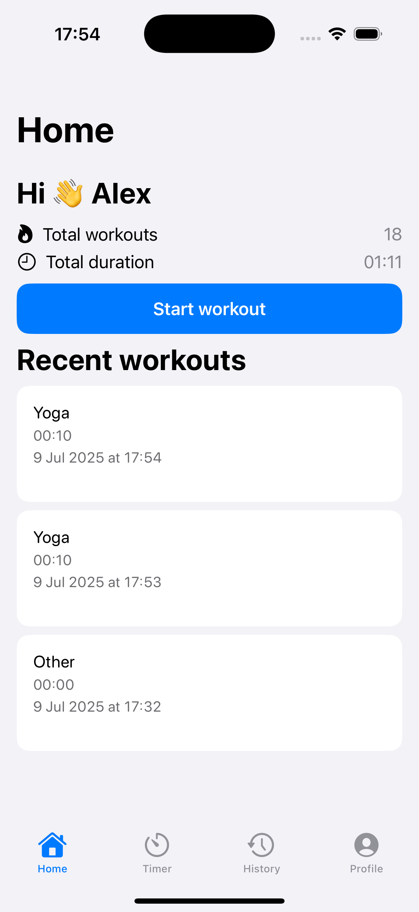
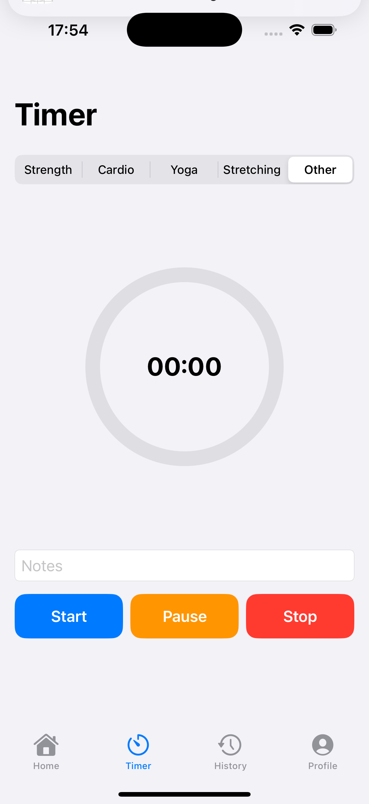
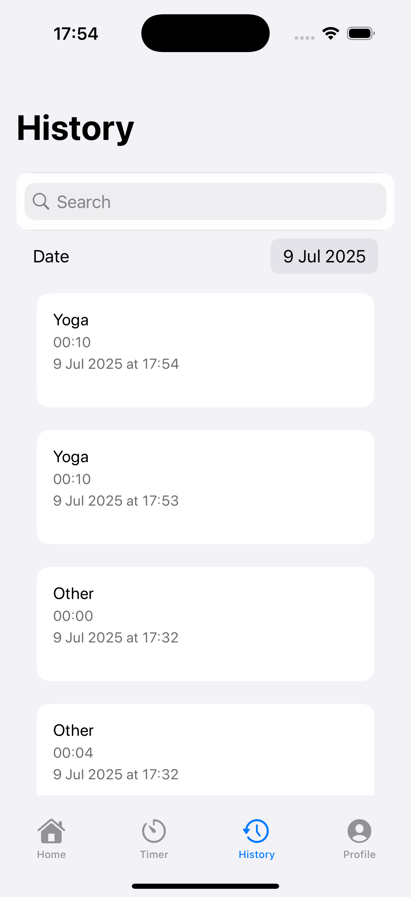
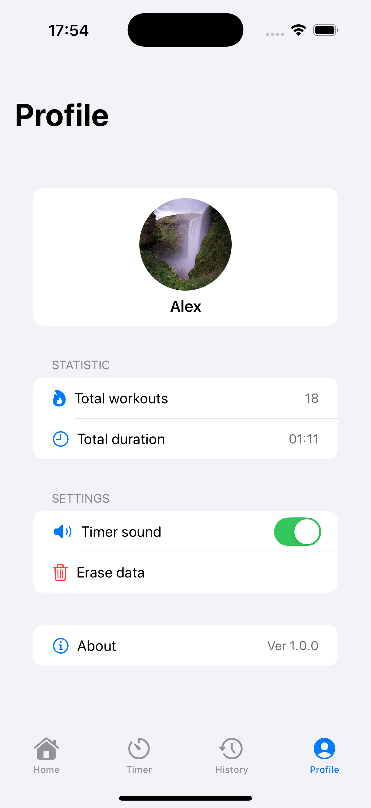

# 🏋️‍♂️ SportTimer – SwiftUI приложение для отслеживания тренировок
---

## 🧠 Архитектурные решения

- **SwiftUI + MVVM**: раздельные `View`, `ViewModel`, `Model`-слои для тестируемости и читаемости.
- **Core Data**: для хранения тренировок и обеспечения работы без интернета.
- **Модульный подход**: каждый экран изолирован и имеет свой `ViewModel`.
- **UserDefaults**: для хранения настроек (звук, имя пользователя).
- **AVFoundation**: для воспроизведения звуков при действиях с таймером.
- **UNUserNotificationCenter**: для отправки локальных уведомлений по окончании тренировки.
- **Многопоточность**: использование `Task`, `MainActor`, `DispatchQueue` для плавного UI и фоновой работы.
---

## ⚠️ Известные ограничения
- Нет экспорта данных или синхронизации между устройствами.
- Отсутствуют юнит-тесты.
- Нет поддержки тёмной темы.
- Нет сложных настроек/категорий тренировок (только предустановленные типы).

---

## 🚀 Инструкция по запуску

1. Открой `.xcodeproj` или `.xcworkspace` в **Xcode 15+**.
2. Убедись, что у проекта включены Background Modes:
    - *Capabilities → Background Modes → Background fetch, Audio*
3. Удостоверься, что `Info.plist` содержит ключи:
    - `NSPhotoLibraryUsageDescription`
    - `NSUserNotificationUsageDescription`
4. Запусти проект на симуляторе или реальном устройстве.
5. На первом запуске разреши доступ к уведомлениям.

---

## 📱 Скриншоты

| Home | Timer | History | Profile |
|------|-------|---------|---------|
|  |  |  |  |

---
